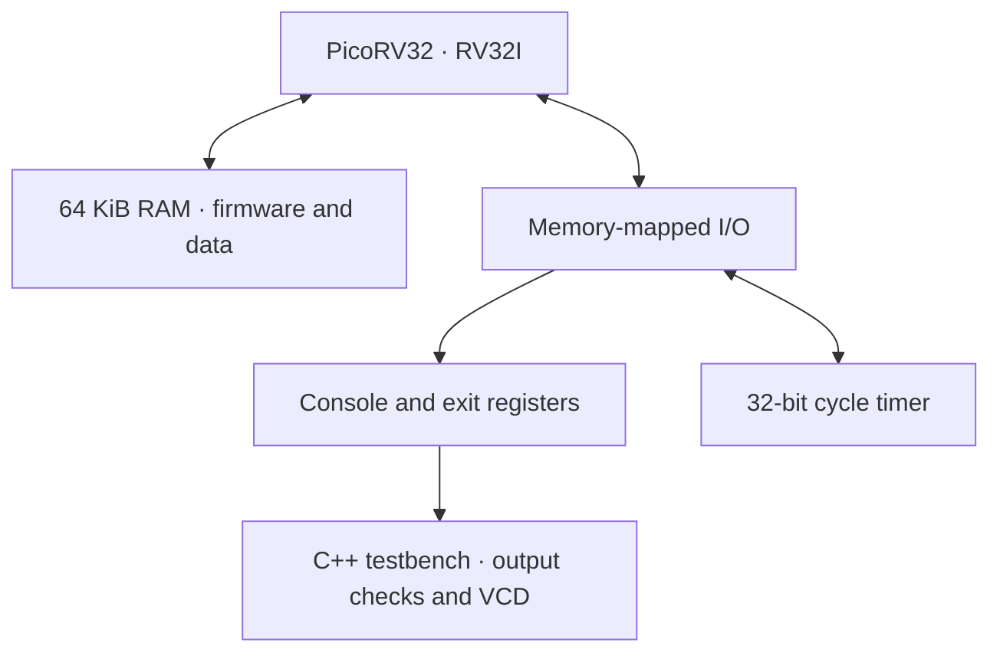
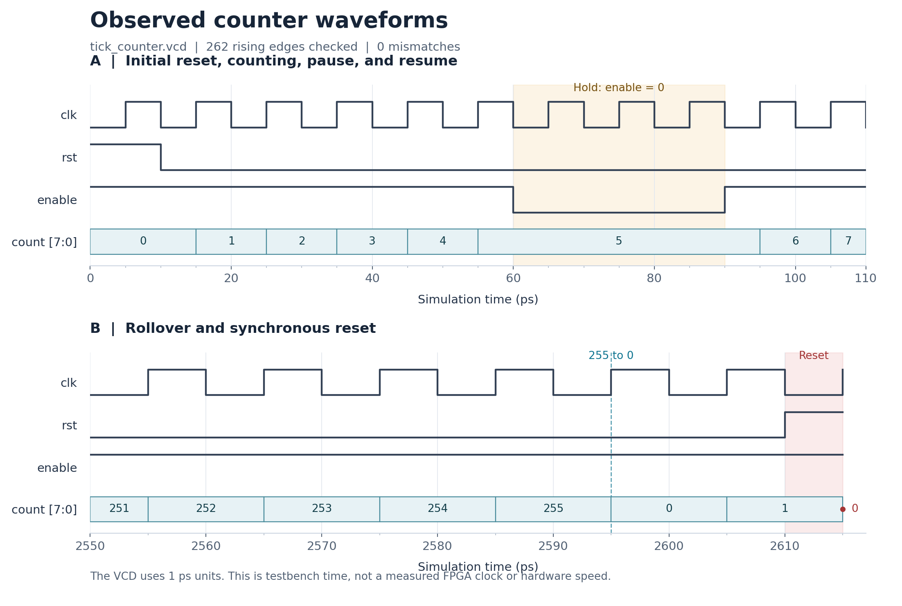

<div align="center">

# DOOM · RISC-V · FPGA Lab

**From a clocked counter to a simulated RISC-V system — working toward DOOM.**


[Overview](#overview) · [Architecture](#architecture) · [Quick Start](#quick-start) · [Validation](#validation) · [Roadmap](#roadmap)

</div>

---

## Overview

An FPGA learning project built around RTL simulation and bare-metal RISC-V
software. The long-term goal is to run classic DOOM on a simulated system
and later explore deployment on an FPGA board.

The current system boots a compiled C program on PicoRV32, prints through
a memory-mapped console, and reads a hardware cycle timer.

**Current milestone:** verified bare-metal firmware execution with a
memory-mapped timer. DOOM integration is planned.

## What Works

| Component | Current implementation |
|---|---|
| RTL learning exercise | 8-bit counter with reset, enable, hold and rollover checks |
| Processor | PicoRV32 configured for RV32I |
| Memory | 64 KiB RAM initialized from a firmware hex image |
| Firmware startup | Stack setup, `.bss` clearing and entry into `main` |
| Console | Memory-mapped output captured by the C++ testbench |
| Timer | Read-only 32-bit cycle counter |
| Completion | Memory-mapped exit code checked by the testbench |
| Build workflow | Firmware compilation and RTL simulation through Make |
| Execution environment | Docker Desktop with Linux containers on Windows |

## Architecture



The C program is compiled into RISC-V instructions. Verilator builds an
executable model of the hardware, and the simulated processor fetches
and executes those instructions from RAM.

The console is a simulation peripheral. A physical serial UART and
board-specific interfaces are future work.

### Memory Map

| Address | Resource | Access |
|---|---|---|
| `0x00000000–0x0000FFFF` | 64 KiB RAM | Instruction fetches and data reads/writes |
| `0x10000000` | Console | Byte or word write; low byte is emitted |
| `0x10000004` | Exit register | Word write; zero indicates firmware success |
| `0x10000008` | Cycle timer | Read |
| Other addresses | Unmapped | Reported as a bus fault |

The timer increments once per rising clock edge after reset is released.
It counts cycles, not milliseconds, and wraps at 32 bits.

## Quick Start

### Requirements

- Git
- Docker Desktop configured for Linux containers
- Internet access for the initial clone and image build

The commands below use **Windows CMD**.

### Clone and Build

```bat
git clone --recurse-submodules https://github.com/Fereydun433/doom-riscv-fpga-lab.git
cd doom-riscv-fpga-lab
docker build -t doom-fpga-lab .
```

For an existing checkout, initialize its dependencies with:

```bat
git submodule update --init --recursive
```

### Run the RISC-V System

From the project root:

```bat
docker run --rm --mount "type=bind,source=%cd%,target=/work" doom-fpga-lab make sim-riscv
```

The command compiles the firmware, generates its RAM image, builds the
RTL simulator, and runs the testbench.

Expected output:

```text
Hello RISC-V
Timer OK
PASS: Hello RISC-V and timer, exit=0.
```

The bind mount makes the current source files available inside Docker
and preserves generated outputs on the host.

### Run the Counter Exercise

```bat
docker run --rm --mount "type=bind,source=%cd%,target=/work" doom-fpga-lab make sim
```

Expected output:

```text
PASS: reset, increment, hold, rollover.
```

## Build and Output Files

| File | Purpose |
|---|---|
| `build/riscv/hello.elf` | Linked RISC-V executable |
| `build/riscv/hello.bin` | Raw firmware image |
| `build/riscv/hello.hex` | RAM initialization: 16384 hexadecimal words |
| `build/riscv/obj_dir/Vhello_soc` | Executable RTL simulator |
| `build/riscv/hello_soc.vcd` | System waveform |
| `build/tick_counter.vcd` | Counter waveform |

The current timer firmware produced a **476-byte binary** with GCC 13.2.0
and `-O0`. The RAM image is padded to 64 KiB; firmware size and RAM capacity
are different measurements.

## Validation

The following results were observed locally on Windows using Docker
Desktop and Verilator:

- Counter: synchronous reset, increment, disabled hold and rollover passed.
- RISC-V boot: the expected console text and zero exit code were observed.
- Timer: firmware successfully read the counter and detected an elapsed
  interval of at least 1000 cycles.
- Automated build: `make sim-riscv` completed successfully.

The testbench also checks for CPU traps, bus faults, unexpected console
output, nonzero exit codes and simulation timeout.

These are integration smoke tests. Full ISA compliance, exhaustive RAM
testing and physical FPGA timing remain outside the current validation.

### Recorded Evidence

- [Counter simulation log](docs/evidence/counter-simulation.log)
- [Counter waveform review](docs/evidence/counter-waveform-review.md)
- [Initial RISC-V boot log](docs/evidence/riscv-hello.log)
- [RISC-V timer log](docs/evidence/riscv-timer.log)



The CPU testbench uses a 10 ns simulated clock period. This setting does
not establish an achievable FPGA clock frequency or host simulation speed.

## Repository Layout

| Location | Purpose |
|---|---|
| `rtl/` | Counter and system RTL |
| `sim/` | C++ testbenches and Verilator warning configuration |
| `firmware/hello/` | C firmware, assembly startup and linker script |
| `scripts/bin2hex.py` | Binary-to-RAM-image conversion |
| `third_party/picorv32/` | Upstream processor submodule |
| `third_party/doomgeneric/` | Upstream DOOM port submodule |
| `docs/evidence/` | Recorded logs and counter waveform analysis |
| `Makefile` | Build and simulation targets |
| `Dockerfile` | Linux tool environment |

## Roadmap

- [x] Establish a Docker-based RTL simulation environment.
- [x] Verify a clocked counter and inspect its waveform.
- [x] Boot a bare-metal C program on PicoRV32.
- [x] Implement a memory-mapped console and exit register.
- [x] Automate firmware compilation and simulation.
- [x] Add and exercise a memory-mapped cycle timer.
- [ ] Define a DOOM memory budget and software runtime.
- [ ] Provide a software time service with defined units.
- [ ] Implement a framebuffer and render a test image.
- [ ] Add keyboard input and game-data access.
- [ ] Integrate DoomGeneric and produce the first game frame.
- [ ] Demonstrate interactive gameplay and measure simulation performance.
- [ ] Explore board-specific FPGA deployment.

## Upstream Projects and Attribution

This project integrates existing open-source components with custom
hardware, firmware, build scripts and simulation checks.

| Project | Role | Recorded revision |
|---|---|---|
| [PicoRV32](https://github.com/YosysHQ/picorv32) | RISC-V processor core | `ef203c2b0a3fb793280f5114941416c425c5b461` |
| [DoomGeneric](https://github.com/ozkl/doomgeneric) | Foundation for the planned DOOM platform port | `dcb7a8dbc7a16ce3dda29382ac9aae9d77d21284` |
| [Verilator](https://verilator.org/) | RTL simulation tool | Version supplied by the build environment |

The DOOM engine was created by id Software and developed further by
source-port contributors. PicoRV32 is maintained by its upstream authors
and contributors.

The project's work focuses on learning, system integration, firmware,
verification and documentation.

## License

Original project code is distributed under **GPL-2.0-only**.
See [LICENSE](LICENSE) and [NOTICE.md](NOTICE.md).

Upstream components retain their own licenses, including PicoRV32's ISC
license. Game WAD files are supplied separately and are not included.

---

Maintained by [Fereydun433](https://github.com/Fereydun433).