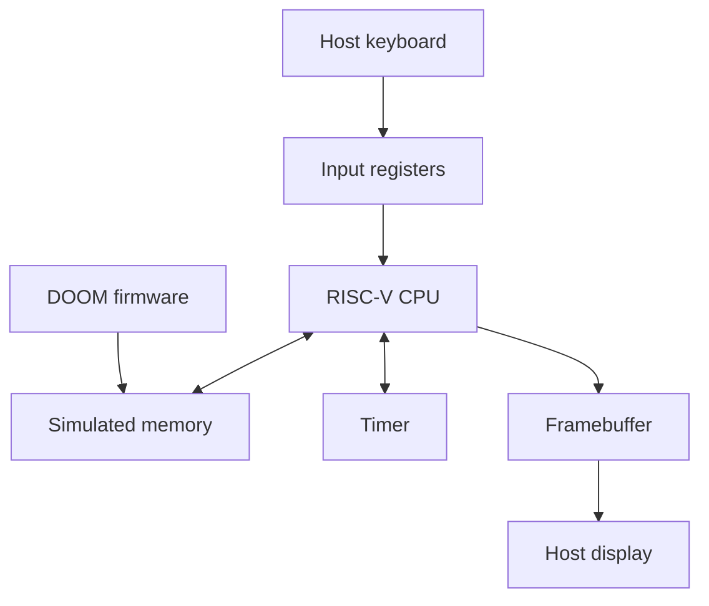

# DOOM RISC-V FPGA Lab

A project to learn FPGA development through RTL simulation, with the goal of
running classic DOOM on a simulated RISC-V system before moving to a physical
board.

**Status: initial development.** This starter contains a Docker environment,
a small SystemVerilog counter experiment, and a C++ simulation harness.
The RISC-V system and the DOOM port are planned work. No physical FPGA board
has been used, and no DOOM performance results are available yet.

## Start here

Requirements: Git, Docker with Linux containers, and internet access for the
first build. On Windows, use Git Bash for the commands below.

From the project directory:

```sh
docker build -t doom-fpga-lab .
docker run --rm doom-fpga-lab make doctor
docker run --rm doom-fpga-lab make sim
```

The simulation checks synchronous reset, enabled counting, disabled hold,
and rollover from 255 to 0. A successful run prints:

```text
PASS: reset, increment, hold, rollover.
```

This is the expected result, not a recorded run. See
[validation status](docs/VALIDATION.md) for what has been checked so far.
The counter experiment does not execute RISC-V instructions or DOOM.

To keep the generated waveform on your computer, use this command in Git Bash
after building the image:

```sh
MSYS_NO_PATHCONV=1 docker run --rm --mount "type=bind,source=$(pwd -W),target=/work" doom-fpga-lab make sim
```

The waveform will be written to `build/tick_counter.vcd`. For Linux or macOS,
use `$(pwd)` instead of `$(pwd -W)` and omit `MSYS_NO_PATHCONV=1`.

## Project scope

| Part | Current state |
| --- | --- |
| Docker tool environment | Build recipe included; first Docker run pending |
| SystemVerilog learning exercise | Counter and simulation checks included |
| GitHub Actions | Workflow included; first hosted run pending |
| DoomGeneric | Add as the upstream submodule using the setup guide |
| LiteX / RISC-V CPU and memory | Planned |
| Framebuffer, timer, and input | Planned |
| DOOM execution in RTL simulation | Planned |
| Physical FPGA deployment | Optional later milestone |

Docker contains the tools. Verilator simulates the digital design. The planned
RISC-V CPU will execute game software compiled for its instruction set.
Host simulation speed and target hardware performance will be reported separately.

## Intended system

The following architecture is a development target, not implemented hardware:



## Repository guide

| Location | Purpose |
| --- | --- |
| `Dockerfile` | Linux tool environment for the first simulation exercise |
| `rtl/tick_counter.sv` | Small synchronous hardware design |
| `sim/tb_tick_counter.cpp` | Verilator driver, checks, and waveform output |
| `Makefile` | Tool reporting, simulation build, and run commands |
| `third_party/doomgeneric` | Upstream game engine, once added as a submodule |
| `docs/ROADMAP.md` | Milestones and the evidence needed to complete each one |
| `docs/GIT_BASH_SETUP.md` | Create and publish the repository from Git Bash |
| `docs/VALIDATION.md` | Current validation status and run-record format |

## Upstream projects and attribution

The DOOM engine comes from id Software and the source-port contributors.
[DoomGeneric](https://github.com/ozkl/doomgeneric) provides a portable interface
for platform initialization, drawing, timing, and keyboard events.
This project's work concerns the environment, hardware experiments, integration,
and evaluation. It does not claim authorship of the original game engine.

The initial upstream reference is
`dcb7a8dbc7a16ce3dda29382ac9aae9d77d21284`. The setup guide adds DoomGeneric as
a Git submodule and checks out that revision. Subsequent clones should use
`git clone --recurse-submodules`.

Game data is supplied separately. No WAD files are included. Keep upstream
copyright notices and license files with the upstream source.

Original code in this starter is licensed under GPL-2.0-only; see [LICENSE](LICENSE).
Upstream components retain their own licenses. See [NOTICE.md](NOTICE.md).

## Technical references

- [LiteX and its simulation quick start](https://github.com/enjoy-digital/litex)
- [Verilator C++ simulation example](https://verilator.org/guide/latest/example_cc.html)
- [DoomGeneric platform interface](https://github.com/ozkl/doomgeneric#porting)
- [Git submodules](https://git-scm.com/book/en/v2/Git-Tools-Submodules)
